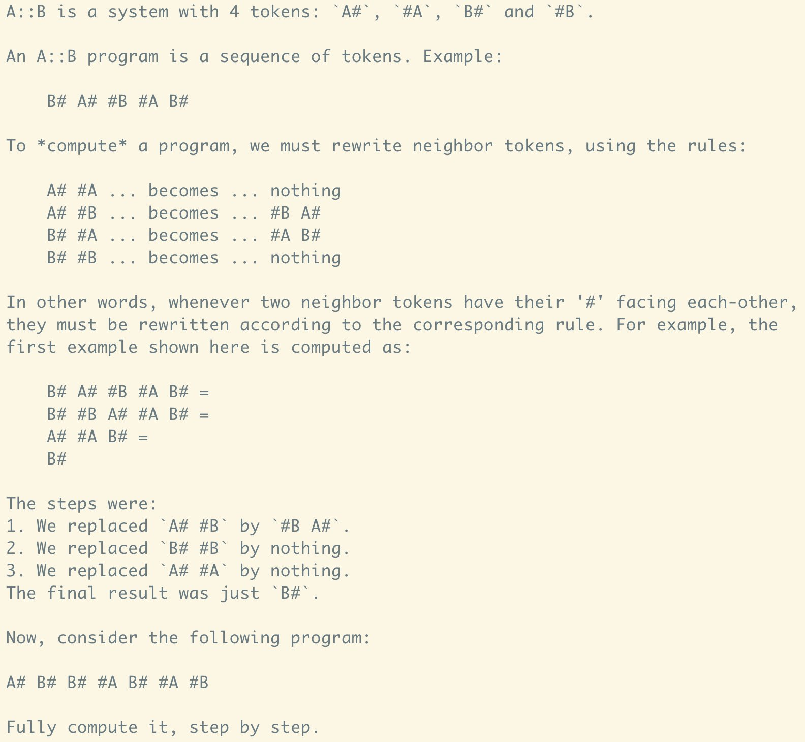

# Memory Hackathon

We attempt to develop an LLM program with memory to solve the A::B Prompting Challenge.

## A::B Prompting Challenge

On April 4, 2024, @Taelin posted [A::B Prompting Challenge on Twitter](https://twitter.com/VictorTaelin/status/1776096481704804789
).

### CHALLENGE

Develop an AI prompt that solves random 12-token instances of the A::B problem (defined in the quoted tweet), with 90%+ success rate.

### RULES

1. The AI will be given a random instance, inside a <problem/> tag.

2. The AI must end its answer with the correct <solution/>.

3. The AI can use up to 32K tokens to work on the problem.

4. You can choose any public model.

5. Any prompting technique is allowed.

6. Keep it fun! No toxicity, spam or harassment.

### EVALUATION

You must submit your system prompt as a reply to this tweet, in a Gist. I'll test each submission in 50 random 12-token instances of the A::B system. The first to get 45 correct solutions wins the prize, plus the invaluable public recognition of proving me wrong 😅 If nobody solves it, I'll repost the top 3 submissions, so we all learn some new prompting techniques :) 

### DETAILS ON GIST
[A::B Prompting Challenge: $10k to prove me wrong!
](https://gist.github.com/VictorTaelin/8ec1d8a0a3c87af31c25224a1f7e31ec)

### RULES

    